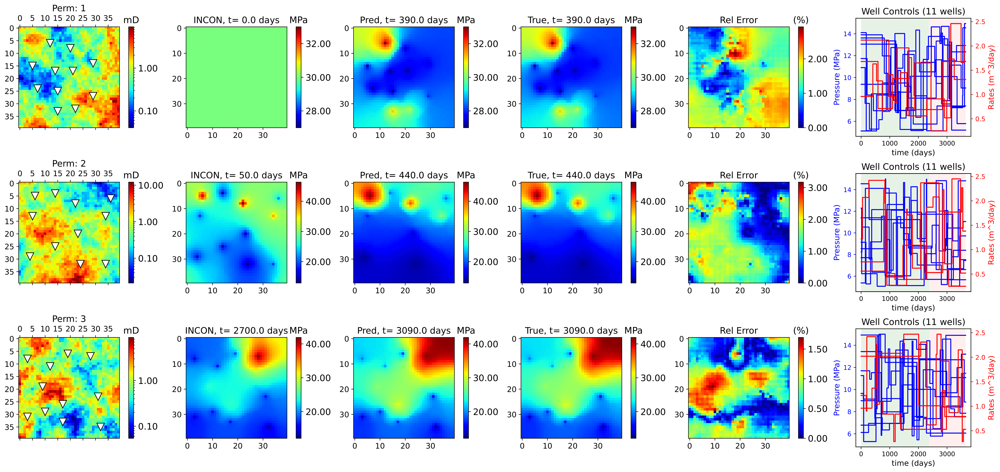
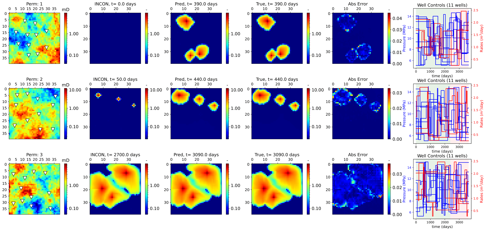

# Neural Operator-Based Proxy for Reservoir Simulations Considering Varying Well Settings, Locations, and Permeability Fields
In this work we introduce a fourier neural operator for predicting pressures and saturations in porous media for new unseen permeability fields, well locations, well controls, and number of wells. Our model is a single model for predicting both pressures and saturations simulataneously. We also introduce a very simple yet efficient data augmentation technique that reduces training simulations by 75% and reduces overfitting.<br/>

## Results
Below are the results of our work. The first image shows pressure predictions, and the second figure shows saturation predictions.



## Datasets
Training and testing datasets can be found in this link: https://drive.google.com/drive/folders/1TodGn-oRwbhjH2t_UJz8b0pCsrXCpMgX?usp=sharing <br/>
* The training set contains 4000 samples, allocating 3500 for training and 500 for validation.<br/>
* The testing set contain 200 samples.<br/>

## Trained models
The Pre-trained model can also available at: https://drive.google.com/drive/folders/1TodGn-oRwbhjH2t_UJz8b0pCsrXCpMgX?usp=sharing <br/>
* Pre-trained model is: ***model_07042024_augmented3500epoch800.pt***
* Losses file is: ***losses_07042024_augmented3500epoch800.npy***

## Requirements
The following versions of NumPy and PyTorch are NOT minimum requirements. The user can work with whichever version they choose<br/>
* [NumPy 1.20.3](https://numpy.org/)<br/>
* [PyTorch 1.10.0](https://pytorch.org/)<br/>

## Citation
```
@article{dbadawi2024,
title={Neural Operator-Based Proxy for Reservoir Simulations Considering Varying Well Settings, Locations, and Permeability Fields},
  author={Daniel Badawi and Eduardo Gildin},
  doi={}
  pages={},
  year={2024},
  publisher={}
  journal={},
}
```
